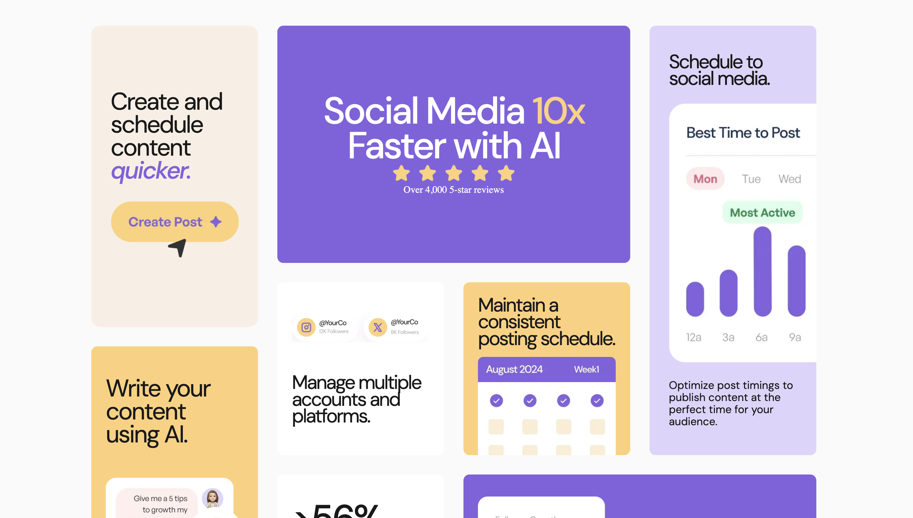

# Frontend-Mentor

Hi!👋 This repository contains all my solutions to challenges from Frontend Mentor, a great platform to practice and improve web development skills.

Overview
Below, you’ll find an overview of each challenge, including:

- Live demo
- Screenshots

More details are in the corresponding folders.

## Overview

### Minimalist portfolio website

- Live Site URL: [Minimalist portfolio website](https://frontend-mentor-h2ju.vercel.app/)

- 

### Dictionary

- Live Site URL: [Dictionary](https://frontend-mentor-bhdw.vercel.app/)

- 

### Bento Grid

- Live Site URL: [Add live site URL here](https://bento-grid-beryl-eight.vercel.app/)

- 

### Age Calculator

- Live Site URL: [Age Calculator](https://frontend-mentor-lovat-two.vercel.app/)

- 

### Advice Generator

- Live Site URL: [Add live site URL here](https://zoelong98.github.io/Advice-generate/)

- 

## Author

- Frontend Mentor - [@ZoeLong](https://www.frontendmentor.io/profile/ZoeLong98)
- Linkedin - [@ZeyuLong](https://www.linkedin.com/in/zeyu-long-13753a324/)
