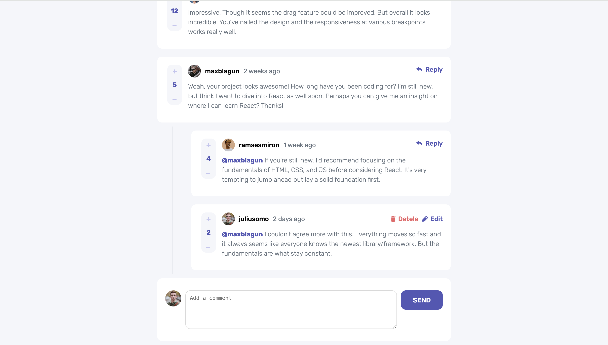

# Frontend Mentor - Interactive comments section solution

This is a solution to the [Interactive comments section challenge on Frontend Mentor](https://www.frontendmentor.io/challenges/interactive-comments-section-iG1RugEG9). Frontend Mentor challenges help you improve your coding skills by building realistic projects.

## Table of contents

- [Overview](#overview)
  - [The challenge](#the-challenge)
  - [Screenshot](#screenshot)
  - [Links](#links)
- [My process](#my-process)
  - [Built with](#built-with)
  - [What I learned](#what-i-learned)
- [Author](#author)

## Overview

### The challenge

Users should be able to:

- View the optimal layout for the app depending on their device's screen size
- See hover states for all interactive elements on the page
- Create, Read, Update, and Delete comments and replies
- Upvote and downvote comments
- **Bonus**: If you're building a purely front-end project, use `localStorage` to save the current state in the browser that persists when the browser is refreshed.
- **Bonus**: Instead of using the `createdAt` strings from the `data.json` file, try using timestamps and dynamically track the time since the comment or reply was posted.

### Screenshot

### Links

- Live Site URL: [Add live site URL here](https://frontend-mentor-qcjr.vercel.app/)

## My process

### Built with

- React

### What I learned

The component order for mobile and laptop views was quite different. Initially, I considered creating two separate files for the layouts, but as more functions were added, this approach became complex and unnecessary. In the end, I managed the layout differences using CSS properties like order, relative, and absolute.

Another key takeaway was learning how to write recursive JavaScript functions to handle nested comments effectively.

## Author

- Frontend Mentor - [@Zoe](https://www.frontendmentor.io/profile/ZoeLong98)
