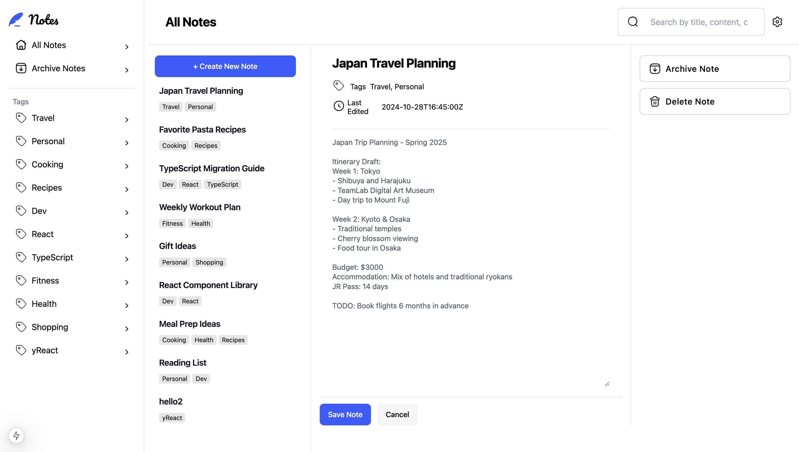
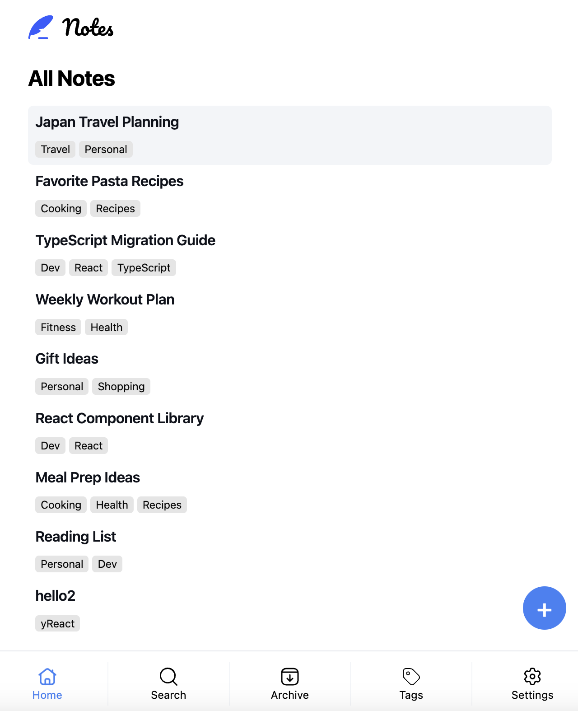

# Frontend Mentor - Note-taking web app solution

This is a solution to the [Note-taking web app challenge on Frontend Mentor](https://www.frontendmentor.io/challenges/note-taking-web-app-773r7bUfOG). Frontend Mentor challenges help you improve your coding skills by building realistic projects.

## Table of contents

- [Overview](#overview)
  - [The challenge](#the-challenge)
  - [Screenshot](#screenshot)
  - [Links](#links)
- [My process](#my-process)
  - [Built with](#built-with)
  - [What I learned](#what-i-learned)
  - [Continued development](#continued-development)
- [Author](#author)
- [Acknowledgments](#acknowledgments)

## Overview

### The challenge

Users should be able to:

- Create, read, update, and delete notes
- Archive notes
- View all their notes
- View all archived notes
- View notes with specific tags
- Search notes by title, tag, and content
- Select their color theme
- Select their font theme
- Receive validation messages if required form fields aren't completed
- Navigate the whole app and perform all actions using only their keyboard
- View the optimal layout for the interface depending on their device's screen size
- See hover and focus states for all interactive elements on the page
- **Bonus**: Save details to a database (build the project as a full-stack app)
- **Bonus**: Create an account, log in, change password (add user authentication to the full-stack app)
- **Bonus**: Reset their password (add password reset to the full-stack app)

### Screenshot

### Links

- Live Site URL: [Notes](https://notes-eta-six.vercel.app/)

## My process

### Built with

- Firestore Database
- React.js
- Tailwind
- Typescript
- Next.js
- vercel

### What I learned

This is the most complicated project I have built so far. I learned a lot by making it a full-stack app, such as realizing that I can't use express-session for authorization since Vercel operates as a serverless platform. The most difficult part for me was organizing the layout properly. The design of the note app is concise and beautiful, and it has two entirely different layouts for laptop and mobile views. It bothered me a lot to figure out how to handle navigation and state management. I ended up using lots of state, and I believe there is a better way to deal with it.

### Continued development

I haven't finished the authentication part, such as changing the password and email confirmation. Also, functions like creating and updating notes aren't smooth and still have a lot of room for improvement.

## Author

- Website - [Zoe](https://www.your-site.com)
- Frontend Mentor - [@ZoeLong98](https://www.frontendmentor.io/profile/ZoeLong98)

## Acknowledgments

This is a huge project that I worked on by myself. I didn't expect it to be so complicated at first and didn't work on it continuously. However, I managed to finish it and feel proud that I didn’t give up.
